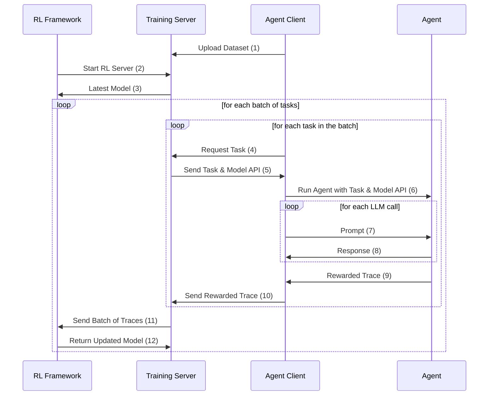

# Server-client Architecture

Article to be written.

```mermaid
sequenceDiagram
    participant RL as RL Framework
    participant TS as Training Server
    participant AC as Agent Client
    participant AG as Agent

    AC->>TS: Upload Dataset (1)
    RL->>TS: Start RL Server (2)
    TS->>RL: Latest Model (3)

    loop for each batch of tasks
        loop for each task in the batch
            AC->>TS: Request Task (4)
            TS->>AC: Send Task & Model API (5)
            AC->>AG: Run Agent with Task & Model API (6)
            loop for each LLM call
                AC->>AG: Prompt (7)
                AG->>AC: Response (8)
            end
            AG->>AC: Rewarded Trace (9)
            AC->>TS: Send Rewarded Trace (10)
        end
        TS->>RL: Send Batch of Traces (11)
        RL->>TS: Return Updated Model (12)
    end
```